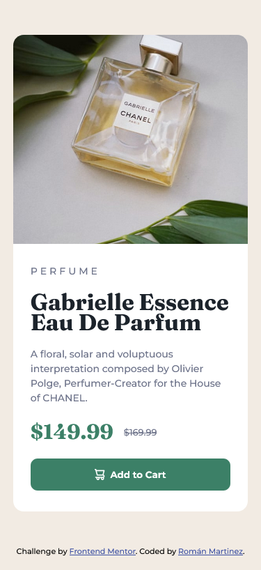

# Frontend Mentor - Product preview card component solution

This is a solution to the [Product preview card component challenge on Frontend Mentor](https://www.frontendmentor.io/challenges/product-preview-card-component-GO7UmttRfa). Frontend Mentor challenges help you improve your coding skills by building realistic projects. 

## Table of contents

- [Overview](#overview)
  - [The challenge](#the-challenge)
  - [Screenshot](#screenshot)
  - [Links](#links)
- [My process](#my-process)
  - [Built with](#built-with)
  - [What I learned](#what-i-learned)
- [Author](#author)


## Overview

### The challenge

Users should be able to:

- View the optimal layout depending on their device's screen size
- See hover and focus states for interactive elements

### Screenshot




### Links

- Solution URL: [https://www.frontendmentor.io/solutions/product-preview-card-component-r_Aoj-yhrP]
- Live Site URL: [https://astonishing-narwhal-f5a3bc.netlify.app/]

## My process

### Built with

- HTML5 markup
- CSS
- Flexbox

### What I learned

Centrar imagen y adaptarla a su contenedor
```css
.img-producto{
    width: 100%;
    height: 100%;
    object-fit: cover;
    object-position: center;
}
```

## Author

- Frontend Mentor - [@ramroman163](https://www.frontendmentor.io/profile/ramroman163)